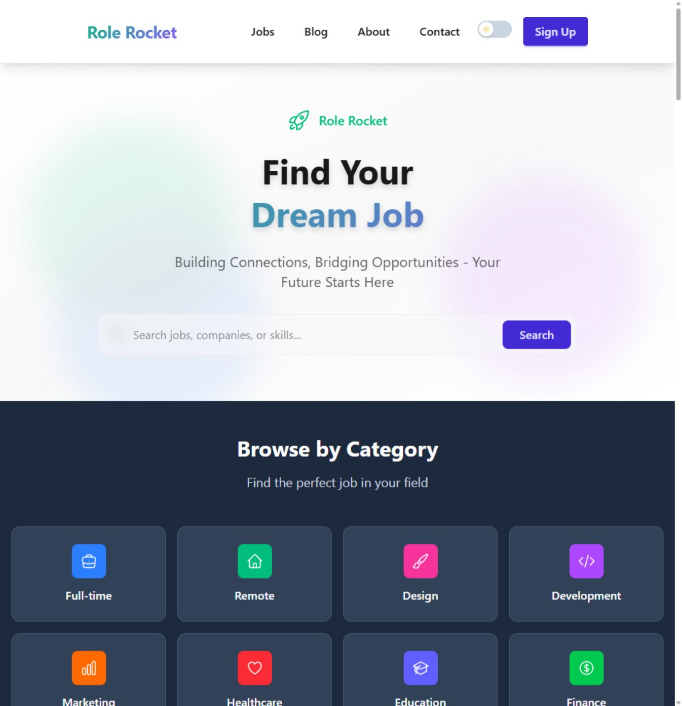
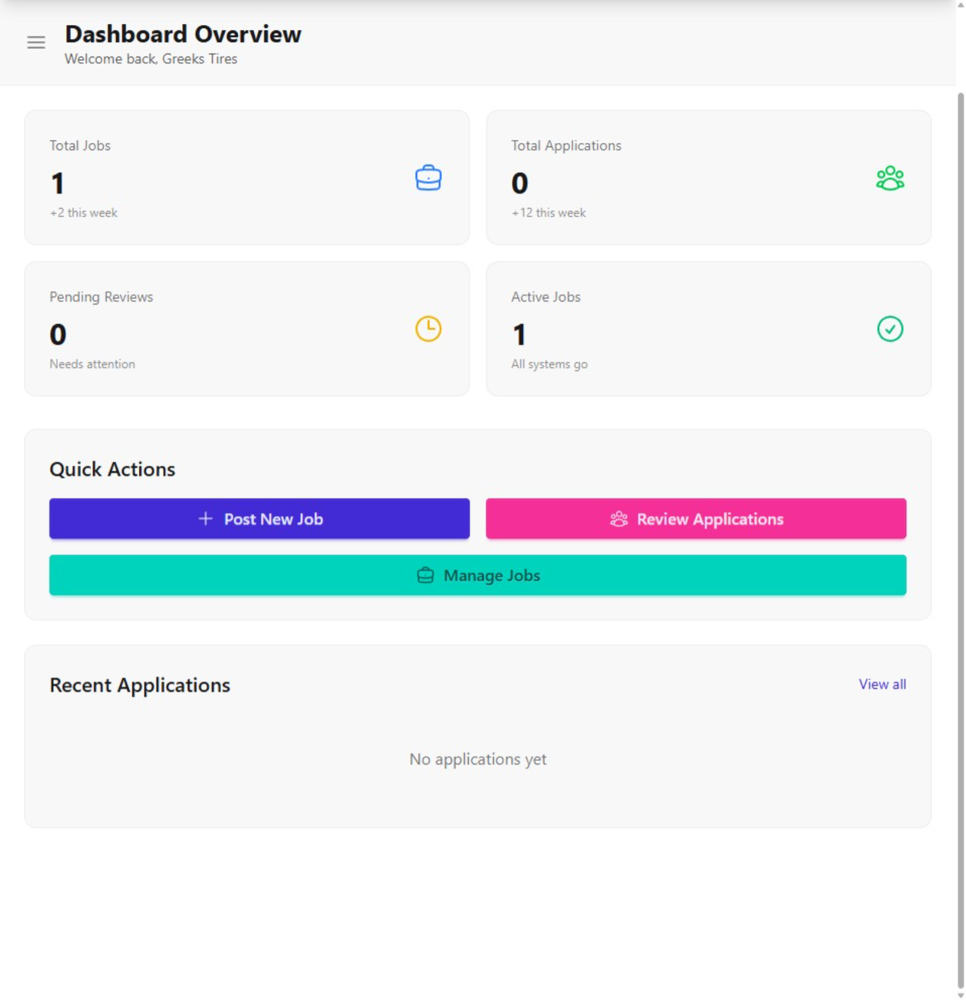

<div align="center">

# Role Rocket

### A Modern Full-Stack Job Board Platform

[](https://my-job-board-peach.vercel.app)
[](https://react.dev)
[](https://firebase.google.com)
[](https://tailwindcss.com)

**Role Rocket** is a production-ready job board application connecting job seekers with employers. Built with modern React patterns, real-time Firebase integration, and a focus on accessibility and performance.

[Live Demo](https://my-job-board-peach.vercel.app) · [Report Bug](https://github.com/TrentonFunt/my-job-board/issues) · [Request Feature](https://github.com/TrentonFunt/my-job-board/issues)

</div>

---

## Table of Contents

- [Overview](#-overview)
- [Key Features](#-key-features)
- [Technical Highlights](#-technical-highlights)
- [Tech Stack](#-tech-stack)
- [Architecture](#-architecture)
- [Getting Started](#-getting-started)
- [Project Structure](#-project-structure)
- [Screenshots](#-screenshots)

---

## Overview

Role Rocket is a comprehensive job board platform designed to serve three distinct user types:

| User Type | Capabilities |
|-----------|-------------|
| **Job Seekers** | Browse jobs, save favorites, track applications, manage profile |
| **Employers** | Post jobs, manage applications, view analytics, track hiring pipeline |
| **Administrators** | Moderate content, manage users, approve employer jobs, platform analytics |

### What Makes This Project Stand Out

- **Real-World Complexity**: Multi-role authentication, job moderation workflows, aggregated job feeds from 3+ external APIs
- **Production Quality**: Deployed on Vercel with proper error handling, loading states, and optimistic updates
- **Modern React Patterns**: Hooks, Context API, code splitting, and component composition
- **Accessibility First**: WCAG 2.1 AA compliant with focus trapping, keyboard navigation, and screen reader support

---

## Key Features

### For Job Seekers
- **Advanced Job Search** - Filter by location, salary, remote status, tags, and company
- **Save Jobs** - Bookmark interesting positions for later review
- **Application Tracker** - Monitor application status (Applied → Interview → Offer)
- **Personalized Recommendations** - Based on search history and saved jobs

### For Employers
- **Job Posting** - Rich job descriptions with requirements, benefits, and salary
- **Application Management** - Review candidates, update statuses, track pipeline
- **Analytics Dashboard** - Views, applications, and conversion metrics
- **Bulk Operations** - Manage multiple jobs/applications efficiently

### For Administrators
- **Job Moderation** - Approve/reject employer-posted jobs before they go live
- **User Management** - Role assignment, account status, user search
- **Notifications** - Send platform-wide announcements
- **Site Settings** - Manage featured tags, branding, and configuration

### Platform-Wide
- **Dark/Light Mode** - System preference detection with manual toggle
- **Fully Responsive** - Optimized for mobile, tablet, and desktop
- **Performance Optimized** - Caching layer, lazy loading, code splitting
- **Accessible** - Focus management, ARIA labels, reduced motion support

---

## Technical Highlights

### Authentication & Authorization
- Email/password authentication with email verification
- Role-based access control (seeker/employer/admin)
- Persistent sessions with secure token refresh
- Protected route wrapper with role checking

### Job Aggregation System
```javascript
// Fetches from 3 external APIs + Firestore employer jobs
// with 5-minute caching and stale-while-revalidate pattern

fetchAggregatedJobs() → [
  Arbeitnow API,      // Tech jobs
  Remotive API,       // Remote jobs  
  Jobicy API,         // Remote-first companies
  Firestore           // Employer-posted (approved only)
] → Deduplicate → Normalize → Cache → Return
```

### Component Architecture
- **Atomic Design**: UI primitives → Composed components → Page layouts
- **Service Layer**: Firebase operations abstracted into reusable services
- **Custom Hooks**: `useJobs`, `useAuth`, `useAdminStatus`, `useUserType`
- **Animation System**: Standardized Framer Motion constants for consistent UX

### Performance Optimizations
| Optimization | Implementation |
|-------------|----------------|
| API Caching | 5-min TTL with localStorage persistence |
| Code Splitting | Route-based lazy loading |
| Image Loading | Lazy loading with blur placeholders |
| Bundle Size | Tree-shaking, minification via Vite |

---

## Tech Stack

### Frontend
| Technology | Version | Purpose |
|------------|---------|---------|
| React | 19.1 | UI framework with hooks |
| Vite | 7.1 | Build tool & dev server |
| React Router | 7.8 | Client-side routing |
| Framer Motion | 12.23 | Animations & transitions |

### Styling
| Technology | Version | Purpose |
|------------|---------|---------|
| Tailwind CSS | 4.1 | Utility-first CSS |
| DaisyUI | 5.0 | Component library |
| Headless UI | 2.2 | Accessible primitives |
| Heroicons | 2.2 | Icon system |

### Backend & Data
| Technology | Version | Purpose |
|------------|---------|---------|
| Firebase Auth | 12.1 | Authentication |
| Cloud Firestore | 12.1 | NoSQL database |
| Axios | 1.11 | HTTP client |

---

## Architecture

```
┌─────────────────────────────────────────────────────────────────┐
│                         CLIENT (React SPA)                       │
├─────────────────────────────────────────────────────────────────┤
│  Pages          │  Components      │  Services      │  Context   │
│  ─────────────  │  ──────────────  │  ───────────── │  ──────── │
│  HomePage       │  ui/             │  jobs.js       │  Auth      │
│  JobDetailPage  │  layout/         │  savedJobs.js  │  Theme     │
│  AccountPage    │  admin/          │                │            │
│  AdminPage      │  employer/       │                │            │
│  EmployerDash   │  account/        │                │            │
└─────────────────────────────────────────────────────────────────┘
                              │
                              ▼
┌─────────────────────────────────────────────────────────────────┐
│                      FIREBASE BACKEND                            │
├─────────────────────────────────────────────────────────────────┤
│  Authentication          │  Firestore Collections               │
│  ──────────────────────  │  ─────────────────────────────────── │
│  • Email/Password        │  users/{uid}                         │
│  • Email Verification    │    └── savedJobs/{jobSlug}           │
│  • Password Reset        │    └── applications/{appId}          │
│                          │  employerJobs/{jobId}                │
│                          │  adminSettings/{settingId}           │
└─────────────────────────────────────────────────────────────────┘
                              │
                              ▼
┌─────────────────────────────────────────────────────────────────┐
│                    EXTERNAL JOB APIs                             │
├─────────────────────────────────────────────────────────────────┤
│  Arbeitnow API  │  Remotive API  │  Jobicy API                   │
│  (Tech Jobs)    │  (Remote Jobs) │  (Remote-First)               │
└─────────────────────────────────────────────────────────────────┘
```

---

## Getting Started

### Prerequisites
- Node.js 18+ 
- npm 10+ or pnpm 8+
- Firebase project (free tier works)

### Installation

```bash
# Clone the repository
git clone https://github.com/TrentonFunt/my-job-board.git
cd my-job-board

# Install dependencies
npm install

# Set up environment variables
cp .env.example .env
# Edit .env with your Firebase config

# Start development server
npm run dev
```

### Environment Variables

Create a `.env` file in the root directory:

```env
VITE_FIREBASE_API_KEY=your_api_key
VITE_FIREBASE_AUTH_DOMAIN=your_auth_domain
VITE_FIREBASE_PROJECT_ID=your_project_id
VITE_FIREBASE_STORAGE_BUCKET=your_storage_bucket
VITE_FIREBASE_MESSAGING_SENDER_ID=your_sender_id
VITE_FIREBASE_APP_ID=your_app_id
VITE_FIREBASE_MEASUREMENT_ID=your_measurement_id
```

### Available Scripts

```bash
npm run dev      # Start dev server (http://localhost:5173)
npm run build    # Production build
npm run preview  # Preview production build
npm run lint     # Run ESLint
```

---

## Project Structure

```
src/
├── components/
│   ├── ui/                    # Reusable UI components
│   │   ├── Button.jsx         # Button with variants
│   │   ├── JobCard.jsx        # Job listing card
│   │   ├── FilterSidebar.jsx  # Filter modal with focus trap
│   │   └── Spinner.jsx        # Loading indicator
│   ├── layout/                # App shell components
│   ├── admin/                 # Admin panel components
│   ├── employer/              # Employer dashboard components
│   └── account/               # User account components
├── pages/                     # Route-level components
├── services/                  # API & Firebase services
│   ├── jobs.js               # Job fetching with caching
│   └── savedJobs.js          # Saved jobs operations
├── hooks/                     # Custom React hooks
├── context/                   # React Context providers
├── lib/                       # Utilities & constants
└── routes/                    # Route configuration
```

---

## Screenshots

<div align="center">

### Home Page - Job Search

*Browse and filter jobs from multiple sources with real-time search*

### Employer Dashboard

*Manage job postings, review applications, and track hiring metrics*

</div>

---

## License

This project is open source and available under the [MIT License](LICENSE).

---

<div align="center">

**Built with ❤️ using React, Firebase, and Tailwind CSS**

[⬆ Back to Top](#-role-rocket)

</div>
